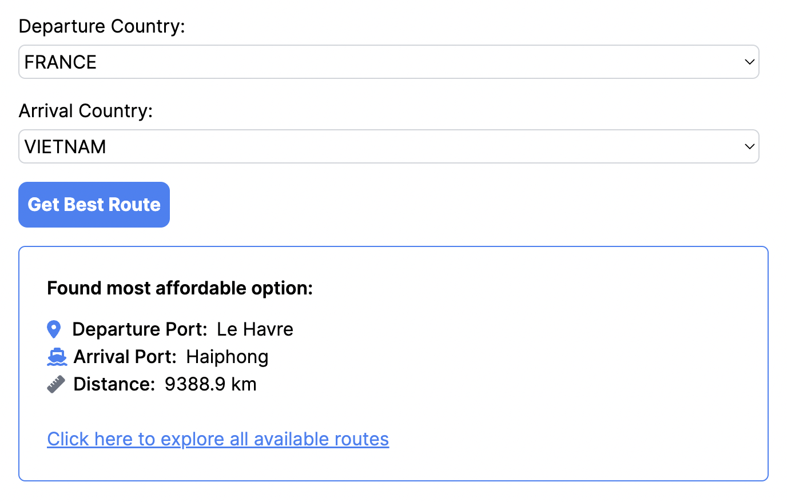
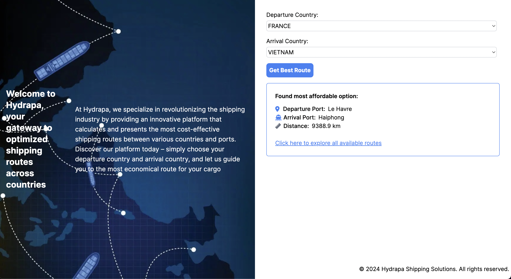
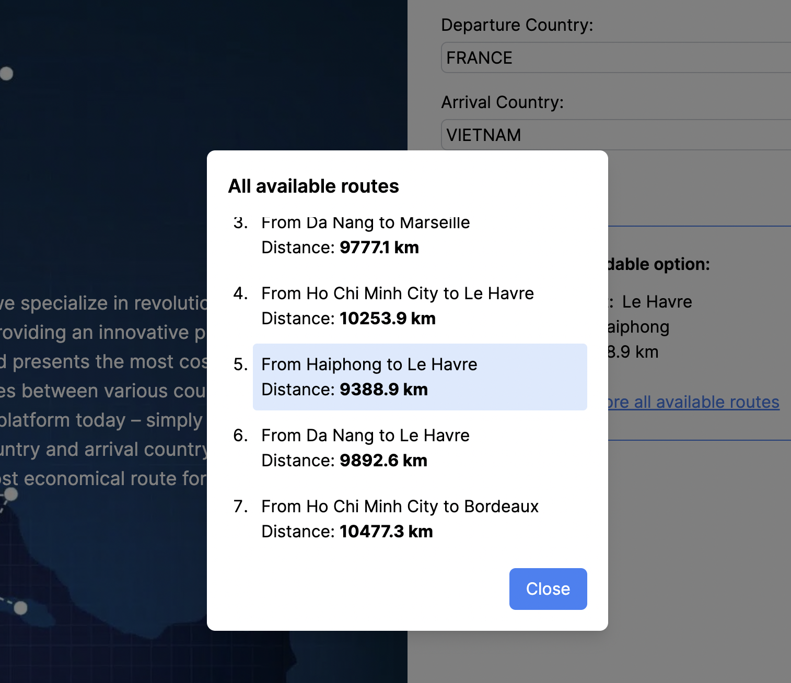

## Introduction

The Hydrapa Shipping is built to provide an intuitive user interface for users to interact with the shipping platform. It communicates with the backend to calculate and display the most affordable shipping routes between selected countries.

## Features

- **Find Best Route:** Calculate the cheapest shipping route between two countries.
  
- **User-friendly Interface:** An easy-to-use UI for selecting source and destination countries.
  
- **Explore Routes:** View available routes and highlight the cheapest option.
  

## Getting Started

1. Before you begin, ensure you have the following installed on your machine:

- [Node.js](https://nodejs.org/)
- [npm](https://www.npmjs.com/) or [Yarn](https://yarnpkg.com/)

2. Install dependencies:
   npm install or yarn install

3. Usage - Start the development server:

```bash
npm run dev
```

or

```bash
yarn dev
```

Open your browser and visit http://localhost:3000 to use the Hydrapa Shipping Platform frontend.

## Project Structure

- **src**: Contains the source code of the frontend application.
- **components**: Reusable UI components.
- **pages**: Next.js pages that define the application's routes.
- **styles**: Stylesheets and global styles.
- **interfaces:** TypeScript interfaces used for type-checking and maintaining a clear data structure.
- **images:** Store images and assets used in the frontend.

## Technologies Used

- React
- Next.js
- Axios
- Tailwind CSS
- Fortawesome
